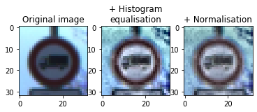

# **Traffic Sign Recognition** 

## Writeup

### You can use this file as a template for your writeup if you want to submit it as a markdown file, but feel free to use some other method and submit a pdf if you prefer.

---

**Build a Traffic Sign Recognition Project**

The goals / steps of this project are the following:

* Load the data set (see below for links to the project data set)
* Explore, summarize and visualize the data set
* Design, train and test a model architecture
* Use the model to make predictions on new images
* Analyze the softmax probabilities of the new images
* Summarize the results with a written report

## Rubric Points
### Here I will consider the [rubric points](https://review.udacity.com/#!/rubrics/481/view) individually and describe how I addressed each point in my implementation.  

---
### Writeup / README

#### 1. Provide a Writeup / README that includes all the rubric points and how you addressed each one. You can submit your writeup as markdown or pdf. You can use this template as a guide for writing the report. The submission includes the project code.

You're reading it! and here is my project code.

- final_ traffic_ sign_ classifier.ipynb

- final_ traffic_ sign_ classifier.html

### Data Set Summary & Exploration

#### 1. Provide a basic summary of the data set. In the code, the analysis should be done using python, numpy and/or pandas methods rather than hardcoding results manually.

I used the pandas library to calculate summary statistics of the traffic
signs data set:

* The size of training set is 3
* The size of the validation set is ?
* The size of test set is ?
* The shape of a traffic sign image is ?
* The number of unique classes/labels in the data set is ?

- Number of training examples = 34799
- Number of testing examples = 4410
- Number of validation examples = 12630
- Image data shape = (32, 32, 3)
- Number of classes = 43

#### 2. Include an exploratory visualization of the dataset.

Here is an exploratory visualization of the data set. It is a bar chart showing how the data ...

### Design and Test a Model Architecture

#### 1. Describe how you preprocessed the image data. What techniques were chosen and why did you choose these techniques? Consider including images showing the output of each preprocessing technique. Pre-processing refers to techniques such as converting to grayscale, normalization, etc. (OPTIONAL: As described in the "Stand Out Suggestions" part of the rubric, if you generated additional data for training, describe why you decided to generate additional data, how you generated the data, and provide example images of the additional data. Then describe the characteristics of the augmented training set like number of images in the set, number of images for each class, etc.)

- First of all, due to the uneven distribution of the categories of the training set (some traffic signs have more pictures than others, and some have fewer), we must increase the number of traffic signs to make them evenly distributed. However, we cannot simply copy the picture, we need to transform the original picture to produce more similar traffic signs. So we need to implement data augmentation.
Data augmentation includes image transformation and generation.

	Image transformation includes two parts, shape and position changes, light changes.
	
	The codes of shape and position changes are shown as follow:
	it include random rotation, scaling, translation, shear operations.

		def random_transform(img,angle_range=[-10,10],
		                    scale_range=[0.8,1.2],
		                    translation_range=[-5,5],
		                    shear_range=[-0.2,0.2]):
		    # Generate random parameter values
		    rotated_img = 255*transf.rotate(img, angle=np.random.uniform(angle_range[0], angle_range[1]), mode='edge')
		    translated_img = transf.warp(rotated_img, transf.SimilarityTransform(translation=(np.random.uniform(translation_range[0], translation_range[1]), np.random.uniform(translation_range[0], translation_range[1]))),mode='edge')
		    scaled_img = transf.warp(translated_img,
		                  transf.AffineTransform(scale=(np.random.uniform(scale_range[0], scale_range[1]), np.random.uniform(scale_range[0],scale_range[1])), shear=np.random.uniform(shear_range[0],shear_range[1])),
		                  mode='edge')
	
	The codes of shape and position changes are shown  as follow:
	
	I transform it into HSV color space, and uese V channel to change the brightness, and then turn it back to RGB color space.
	
		def random_brightness(image,min_bright=0.25,max_bright=1):
		    image = image.astype(np.uint8)
		    image1 = cv2.cvtColor(image,cv2.COLOR_RGB2HSV)
		    random_bright = np.random.uniform(min_bright, max_bright)
		    image1[:,:,2] = image1[:,:,2]*random_bright
		    image1 = cv2.cvtColor(image1,cv2.COLOR_HSV2RGB)
		    return image1
	
	Here is an example of a traffic sign image before and after data augumentation.

   After that i need generate more transformed images so that each traffic sign categorie has the same number of training samples.

  Here is an histogramm of augmented training data set.
  Each catagorie has the same number of images(4000).

- Secondly, I need preprocess the images before training a model.

	The first step is perfom a histogram equalization. Grayscale image will lose some information of original images. So i will not use this methods. But during histogram equalization, we take the values from 0 to 100 and stretch them to range from 0 to 255. This way, we are utilizing all the available values and the image will have much better contrast. So it is better as grayscale.
	
	The seconde step is normalisation. Normalisation will make our images have same feature values distibution. We should not have a per-weight learing weight. Thus we need normalize image before using deep learning model.
	
	Here is an example of a traffic sign image before and after data preprocessing.

After all these data augmentation and image proprecessing, the new dataset are shown as below:

#### 2. Describe what your final model architecture looks like including model type, layers, layer sizes, connectivity, etc.) Consider including a diagram and/or table describing the final model.

Densenet is one of the most powerful neural network model, it is smaller and more efficient.

In DenseNet each layer is connected to every other layer in the network in a feed forward fashion. For each layer, the feature-maps of all preceding layers are used as input, and its own feature-maps are concatenated with its input into a single tensor and the used as inputs into its subsequent layer. A standard feed forward CNN with L layers will have L connections (one between each layer), DenseNet with its densely connected scheme must have (L+1)/ 2 direct connections. This setting is illustrated below:

The dense block is shown as below：

New research shows that, densenet have  better performance than resnet.
Thus in this project I use densenet model.

My final model consisted of the following layers:

the dense block process will concatenate all previous layers to current layers.

the bac process include batch_norm->relu->conv2d->dropout

the bn process is batch_norm.

- Inital convolution
	number of features : 12
	
	input shape: (?, 32, 32, 3)
	
	conv kern size: 3x3 padding size: 1x 1
	
	conv_1 shape: (?, 32, 32, 16)

- First DenseBlock

	block_1 shape: (?, 32, 32, 160)
	
	block_1 features number: 160
	
	conv kern size: 12x12 padding size: 1x 1
	
	bac_1 shape: (?, 32, 32, 160)
	
	pool_1 shape: (?, 16, 16, 160) kern size 2*2

- Second DenseBlock

	block_2 shape: (?, 16, 16, 304)
	
	block_2 features number: 304
	
	conv kern size: 12x12 padding size: 1x 1
	
	bac_2 shape: (?, 16, 16, 304)
	
	pool_2 shape: (?, 8, 8, 304) kern size 8x8

- Third DenseBlock

	block_3 shape: (?, 8, 8, 448)
	
	features number: 448
	
	bn_3 shape: (?, 8, 8, 448)
	
	relu_3 shape: (?, 8, 8, 448)
	
	pool_3 shape: (?, 1, 1, 448)kern size 8x8

- final features: 448

#Output

#### 3. Describe how you trained your model. The discussion can include the type of optimizer, the batch size, number of epochs and any hyperparameters such as learning rate.

To train the model, I used  MomentumOptimizer, l2-regulation, mini-batch optimierung methods.

EPOCHS = 30 (because the training time too long ,so I did not set it more bigger， i think epochs=30 is basicly enough.)

BATCH_SIZE = 64

LEARNING_RATE =0.01

KEEP_PROB = 0.9

WEIGHT_DECAY=0

#### 4. Describe the approach taken for finding a solution and getting the validation set accuracy to be at least 0.93. Include in the discussion the results on the training, validation and test sets and where in the code these were calculated. Your approach may have been an iterative process, in which case, outline the steps you took to get to the final solution and why you chose those steps. Perhaps your solution involved an already well known implementation or architecture. In this case, discuss why you think the architecture is suitable for the current problem.

My final model results were:

training set accuracy of 1.000

validation set accuracy of 0.988 

test set accuracy of 0.9822

### Test a Model on New Images

#### 1. Choose five German traffic signs found on the web and provide them in the report. For each image, discuss what quality or qualities might be difficult to classify.

Here are five German traffic signs that I found on the web:

The seven image might be difficult to classify because there are 3 type traffic sign, only the mid one is right.

#### 2. Discuss the model's predictions on these new traffic signs and compare the results to predicting on the test set. At a minimum, discuss what the predictions were, the accuracy on these new predictions, and compare the accuracy to the accuracy on the test set (OPTIONAL: Discuss the results in more detail as described in the "Stand Out Suggestions" part of the rubric).

The model was able to correctly guess 4 of the 5 traffic signs, which gives an accuracy of 80%. 

#### 3. Describe how certain the model is when predicting on each of the five new images by looking at the softmax probabilities for each prediction. Provide the top 5 softmax probabilities for each image along with the sign type of each probability. (OPTIONAL: as described in the "Stand Out Suggestions" part of the rubric, visualizations can also be provided such as bar charts)

As you can see, my model can realize 99% softmax probabilities for each prediction.

The final DenseNet accuracy on the online images set is 100.0 %

### (Optional) Visualizing the Neural Network (See Step 4 of the Ipython notebook for more details)
#### 1. Discuss the visual output of your trained network's feature maps. What characteristics did the neural network use to make classifications?

# CarND-Traffic-Sign-Classifier-Project
# CarND-Traffic-Sign-Classifier
